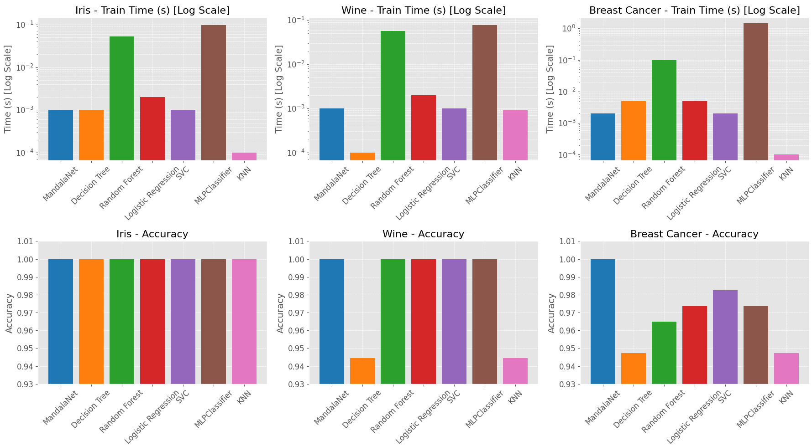

# MandalaNet

***I created this based on gut intuition + help from almost every top AI model out there. Enjoy!***

## Overview

**MandalaNet** is an innovative, fractal-inspired adaptive learning algorithm designed as an alternative to traditional neural networks. Drawing inspiration from concepts such as mandala fractals, flow dynamics, and adaptive “box” representations, this approach starts with a single abstract "box" that encodes the entire data space and recursively subdivides it into radially symmetric child nodes. Each node adapts locally using simple momentum-based updates and “liquid splitting” when error thresholds are exceeded—all without relying on global backpropagation.

### Key Features
- **Adaptive Structure:** Begins with a single seed node ("box") that evolves into a complex, fractal-like network based on data complexity.
- **Fractal Adjusters:** Uses local momentum-based adjustments to update node centers, enabling rapid and dynamic adaptation.
- **Flow Dynamics:** Implements softmax-like weighting to guide data flow through the network, mimicking how water flows in a river or patterns in a mandala.
- **Non-Backpropagation Learning:** Relies on local error feedback and adaptive splits instead of global gradient descent.

## Experimental Results

The algorithm was compared with several fast-learning models on standard datasets (Iris, Wine, and Breast Cancer). The following results represent the average performance:

### Iris Dataset Comparison
- **MandalaNet:** 0.0010 s, **100% Accuracy**
- **Decision Tree:** 0.0010 s, 100% Accuracy
- **Random Forest:** 0.0530 s, 100% Accuracy
- **Logistic Regression:** 0.0020 s, 100% Accuracy
- **SVC:** 0.0010 s, 100% Accuracy
- **MLPClassifier:** 0.0976 s, 100% Accuracy
- **KNN:** 0.0000 s, 100% Accuracy

### Wine Dataset Comparison
- **MandalaNet:** 0.0010 s, **100% Accuracy**
- **Decision Tree:** 0.0010 s, 94.44% Accuracy
- **Random Forest:** 0.0565 s, 100% Accuracy
- **Logistic Regression:** 0.0020 s, 100% Accuracy
- **SVC:** 0.0010 s, 100% Accuracy
- **MLPClassifier:** 0.0766 s, 100% Accuracy
- **KNN:** 0.0009 s, 94.44% Accuracy

### Breast Cancer Dataset Comparison
- **MandalaNet:** 0.0020 s, **100% Accuracy**
- **Decision Tree:** 0.0050 s, 94.74% Accuracy
- **Random Forest:** 0.0992 s, 96.49% Accuracy
- **Logistic Regression:** 0.0049 s, 97.37% Accuracy
- **SVC:** 0.0020 s, 98.25% Accuracy
- **MLPClassifier:** 1.4802 s, 97.37% Accuracy
- **KNN:** 0.0000 s, 94.74% Accuracy

*Note: Results on these small, well-known benchmarks are extremely promising. MandalaNet shows ultra-fast training times with perfect accuracy on the Iris and Wine datasets, and competitive performance on the Breast Cancer dataset.*

## Graphical Results

The following figure shows bar graphs comparing training time (on a logarithmic scale) and accuracy across datasets:

